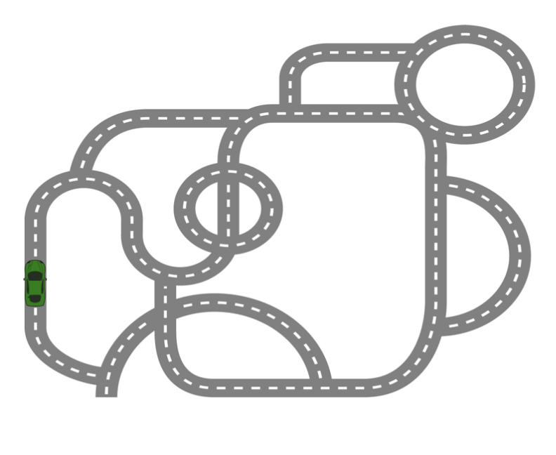
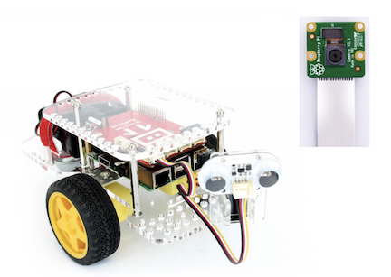
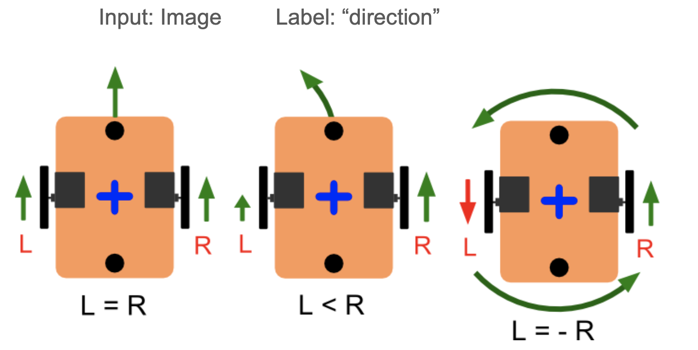
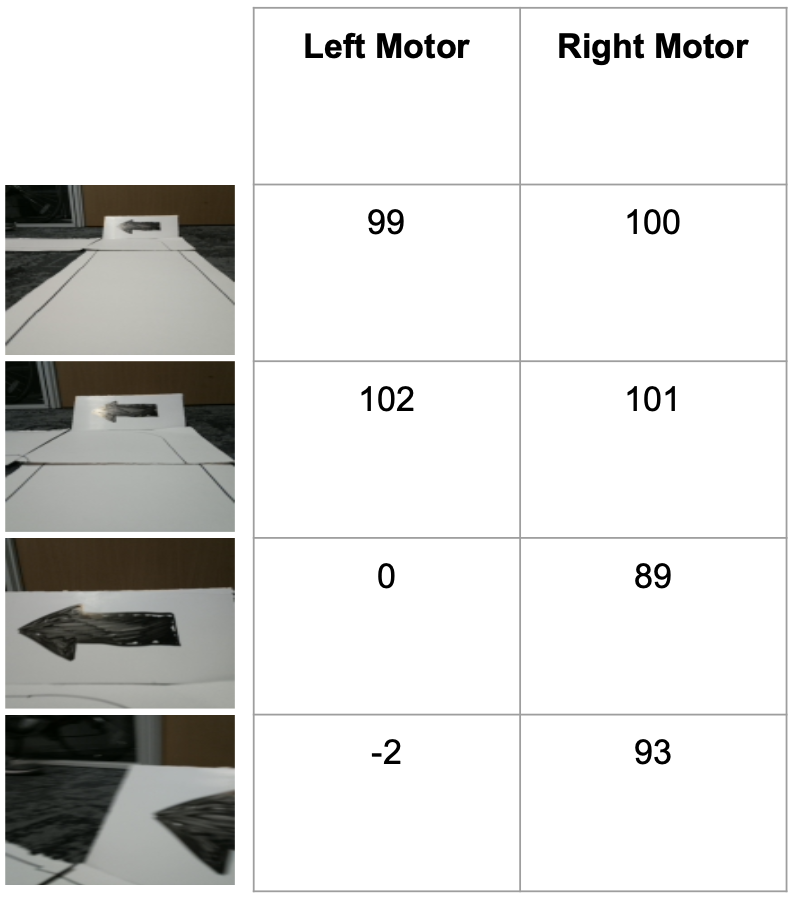
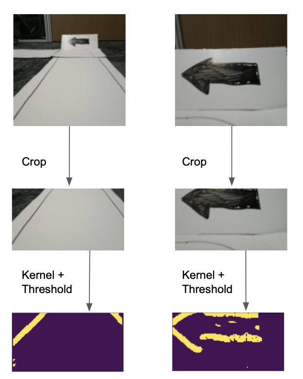
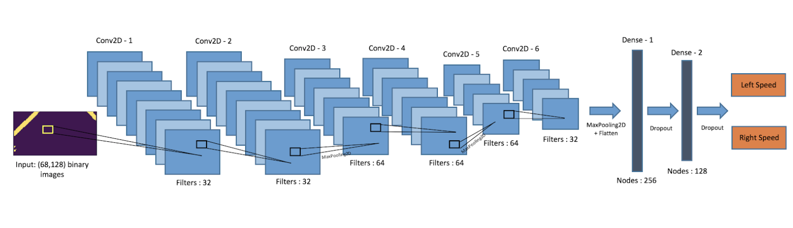
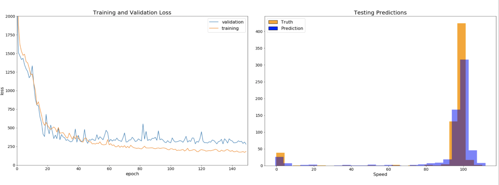
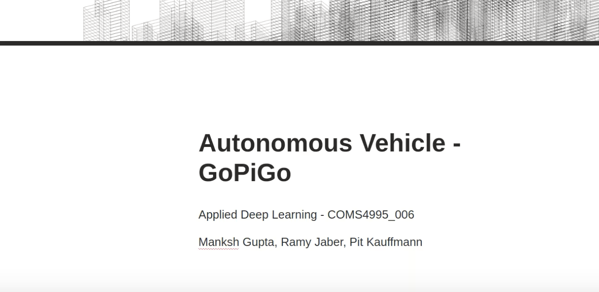

# Applied Deep Learning Project : Autonomous_Vehicle

In this project we construct and train an autonomous car to navigate a track using a single camera and the GoPiGo3 by Dexter Industries. In this repository, we provide the code and instructions on how to collect training data, train a deep learning (CNN) model, and deploy it to a Raspberry Pi controlled car. The inception of this project was in a class, COMS4995_006 Applied Deep Learning at Columbia University SEAS in the Fall of 2018. 

## Submission Notes
The project combines hardware and software elements and thus, we cannot make this run end-to-end by running a bash script. We walk the reader through our project and what the notebooks do individually. This can then be implemented by any user if they have the required hardware. The goal is lane keeping, i.e., put the robot on a track and have it follow the track by making on-line predictions using a pre trained model. 

<p align="center">
  
</p>

## Requirements

### Hardware

1. [GoPiGo](https://www.dexterindustries.com/shop/gopigo-beginner-starter-kit/) by Dexter Industries
2. RaspberryPi
3. Raspberry Pi Camera

<p align="center">
  
</p>

### Software

1. Raspbian for Robots - This must be installed on the GoPiGo, replacing DexterOS
    * Higher overhead to install
    * Flexibility to install anything
    * Latest Tensorflow version
2. Python Libraries:
    * Tensorflow
    * GoPiGo
    * PiCamera
    * openCV
 
 
## Steps

Now, we will walk through the steps of setting up data collection, training and prediction notebooks. 

### Step 1 - Data Collection

The GoPiGo uses differential steering to make turns, thus for the training process, we manually drive the robot on a track and click images while driving and collect the left and right wheel speeds as the data we want to predict.

<p align="center">
  
</p>

<p align="center">
  
</p>

We use the following notebooks(to be run on the raspberry pi) to collect the training data:

```
1. data_collection_remote_control_final.ipynb
  * This notebook lays out functionality to control the GoPiGo using python(on raspian for robots)
2. data_collection_capture_final.ipynb
  * This notebook captures images while the car is driving, run after running data_collection_remote_control.ipynb
```

### Step 2 - Data Preprocessing

Data preprocessing is a very important stage of the modeling process, we want to detect and keep lanes, thus its important that the model can identify edges on the created track and associate these with the speeds. We tried various preprocessing techniques and finalised on the following:

1. Crop top part of each image to ensure that only nearby signals are used to make a turning decision
2. Apply [Sobel Kernels](https://en.wikipedia.org/wiki/Sobel_operator) for both x and y directions to detect edges (i.e. where the track “ends”)
3. Threshold the resulting images to binary to emphasize edges
4. Shift dependent variable to account for time lag in capturing images.

<p align="center">
  
</p>

The corresponding functions can be found in the utils file and is a part of the 'load data' function. It is actually called in the model training notebook that we will talk about shortly.

### Step 3 - Model Training & Evaluation

```
Goal: Construct a single-input, multi-output Convolutional Neural Network
  * Input: processed images
  * Output: left and right motor speed
  ```
The network architecture we are using is as follows:

<p align="center">
  
</p>

This architecture is implemented in the follwoing notebook:

```
1. model_training_final.ipynb
  *This notebook contains code to train the model that we will finally use. It also preprocesses images. 
  *The notebook finally outputs a trained model in the form of a final_trained_model.h5 and a final_trained_model.json
  *These files can simply be imported in another notebook/device using tensorflow to make predictions on new data.
```

We observe very promising results from the above architecture. We compared various architectures using the training/validation curves of the learning process and we also looked at histograms of predictions vs actual values. Results for the deployed model are as follows:

<p align="center">
  
</p>

### Step 4 - Model deployment & Making Predictions

The model deployment process is straightforward from here, after the model_training_final.ipynb notebook is run, it will give you the model as an .h5 and a .json file. Now, one can simply copy these files to the raspberry pi and load the model using tensorflow. The only thing that causesm issues here is that dependency management in raspberry pi is a manual process and one must be careful to download and install all required dependencies. 

Making Predictions is where the moment of truth is! We see from the model evaluation that our results 'look' promising, however, we cannot say how good or bad they are until we actually test them on the robot and make predictions while driving. How the mechanics works is:

1. Run car on track, capturing ~4 images per second
2. Process images similar to training
3. Pass each image through the model and predict speeds live
4. Feed these speeds to the robot and drive accordingly


The following notebook provides this functionality:

```
1. lane_keep_testing_final.ipynb
  * This notebook uses a pretrained model( .h5 and .json) files to make online predictions on the GoPiGo.
```
The car then behaves in the following way:

<p align="center">

<a href="http://www.youtube.com/watch?feature=player_embedded&v=BYgPynmwE2Y" target="_blank"></a>

</p>

This concludes the training and prediction process of our autonomous vehicle. We also have a video below that explains the code and has a walkthrough of the whole project. This can be used in addition to the notebooks here to make your own GoPiGo autonomous robot. Enjoy!


<p align="center">

<a href="http://www.youtube.com/watch?feature=player_embedded&v=sg0y5bpEi9A&t=2s" target="_blank"></a>

</p>


